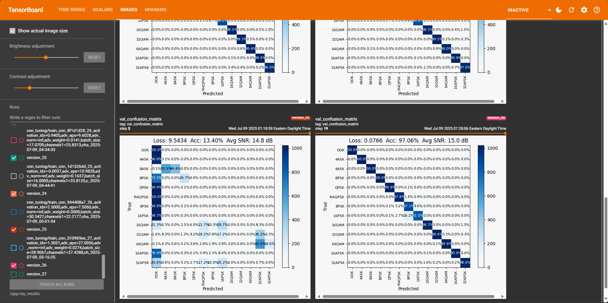

# ModifiedDieselWolf

A PyTorch Lightning based research platform for automatic modulation recognition (AMR). The project builds on the original DieselWolf dataset and adds more data augmentations, training utilities and deployment scripts.

## Getting Started

Build the Docker image and start the container:

```bash
docker build -t dieselmod .
docker run --gpus all -it --rm -p 8888:8888 -p 6006:6006 -v $(pwd):/app dieselmod
```

The container launches **JupyterLab** on port `8888` and **TensorBoard** on port `6006`. Navigate to `http://localhost:8888` to open the notebooks and `http://localhost:6006` to monitor training logs.

Inside JupyterLab open a terminal and set the `PYTHONPATH` before running any scripts:

```bash
export PYTHONPATH=$PYTHONPATH:/app
```

For example, you can reproduce the CNN tuning session by running:

```bash
python scripts/tune_cnn.py --max-trials 10
```
TensorBoard includes embedding projections of the best model from each trial.

## Repository Highlights

- **Augmentations:** `dieselwolf/data/TransformsRF.py` includes fractional resampling with `DopplerShift` and fading models `TDLRayleigh`, `TDLRician` and `TDLNakagami`.
- **Quantisation:** convert checkpoints with `scripts/export_onnx.py` and `scripts/quantize_onnx.py`.
- **Tutorial notebooks:** see the `notebooks/` directory for dataset walkthroughs and training examples.
- **Complex models:** `dieselwolf/complex_layers.py` and `dieselwolf/models/complex_transformer.py` enable complex-valued networks such as `configurable_mobile_rat.py`.
- **Modular architectures:** `dieselwolf/models/configurable_cnn.py` and `dieselwolf/models/configurable_mobile_rat.py` expose a modular design for easy tuning.
- **Lightning module:** `dieselwolf/models/lightning_module.py` wraps a backbone with projection heads for metadata regression and supports fast-gradient adversarial perturbations.
- **Insightful callbacks:** `dieselwolf/callbacks.py` generates embedding projections with metadata and logs a confusion matrix image to TensorBoard.
- **MoCo-v3 pre-training:** `dieselwolf/models/moco_v3.py` implements a lightweight momentum encoder for semi-supervised learning on unlabeled RF data.
- **CI/CD practices:** GitHub workflows and pre-commit hooks with `ruff` and `black` enforce consistent formatting and smoke-test training.

## Demo




https://github.com/user-attachments/assets/3b49f5b9-b155-44b6-b79b-f788e19e5224


